# ESPX-CP05-Edge-Computing
CP05 de Edge Computing - Monitoramente de uma Adega de uma Vinheria Teorica. Monitorando Temperatura, Luminosidade, Umidade e Nivel d'agua em casa de Inundação.

--- 

## Integrantes:

- Guilherme Satler Macedo     - RM 563330

- Laura Sousa Barreto         - RM 561965

- Matheus Freitas Vieira      - RM 566198

- Natalia Camargo de Souza    - RM 565769

---

#### Professor: Paulo Marcotti

### Docker FIWARE do professor Fábio Cabrini utilizado:
https://github.com/fabiocabrini/fiware

---

# Projeto Hands-On

Video demonstrando o funcionamento do ESP32 enviando dados de diversos sensores para o servidor Azure, com o FIWARE em funcionamento para a execução de uma IOT Cloud.

E com a confirmação do funcionamento do servidor e FIWARE coma utilização do PostMan.

https://youtu.be/6yw99pNxt34?si=EcjmgeKY3tj_qCBy

## Dispositivo

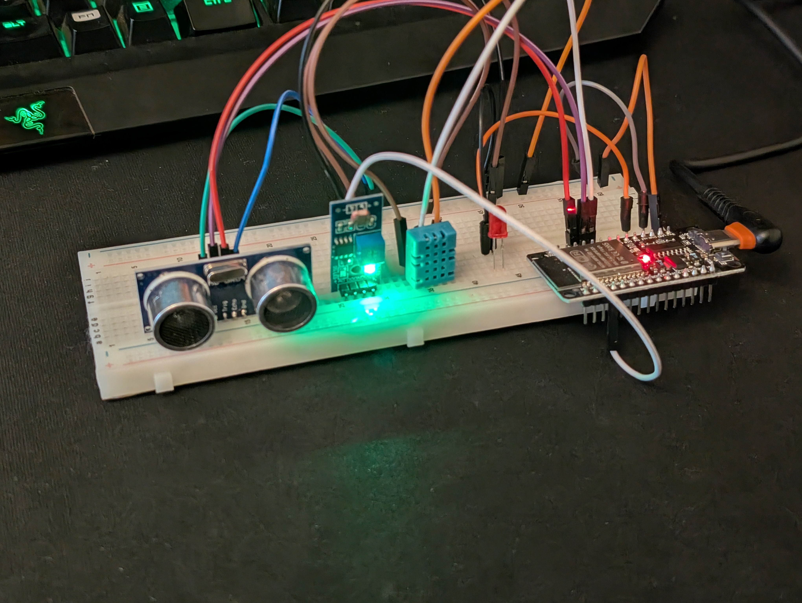

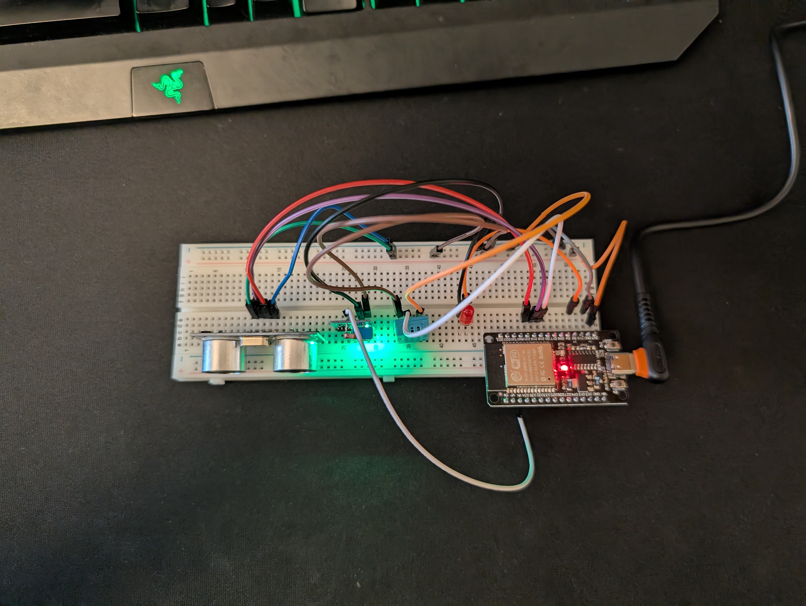

### Diagrama do dispositivo (WOKWI)

Diagrama reproduzindo a fiação do dispositivo
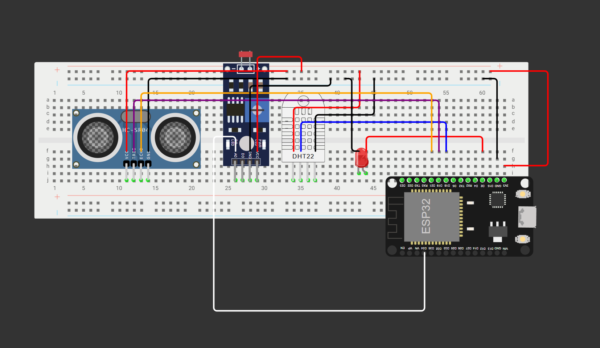
https://wokwi.com/projects/444829650403562497

Diagrama simplificado do dispositivo
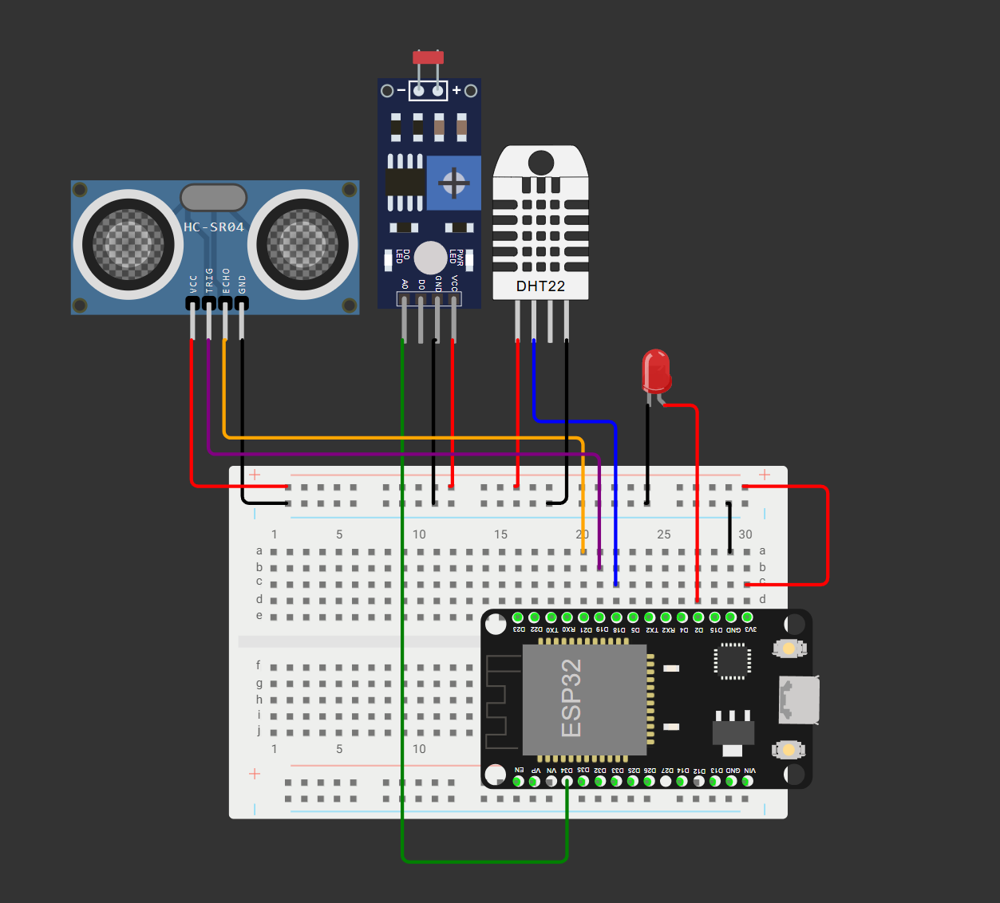
https://wokwi.com/projects/445188474601375745

---
### Screenshot da página do VM no Azure

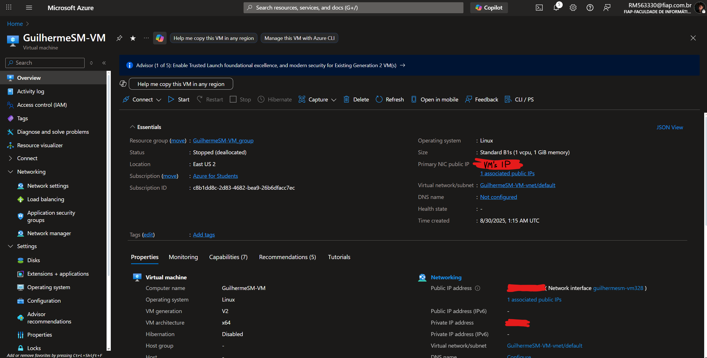

---

### Screenshots da Comunicação do PostMan com o FIWARE no servidor AZURE

#### MQTT Health Check
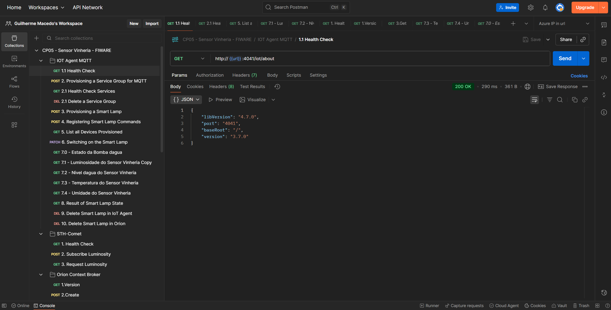

#### Services Health Check
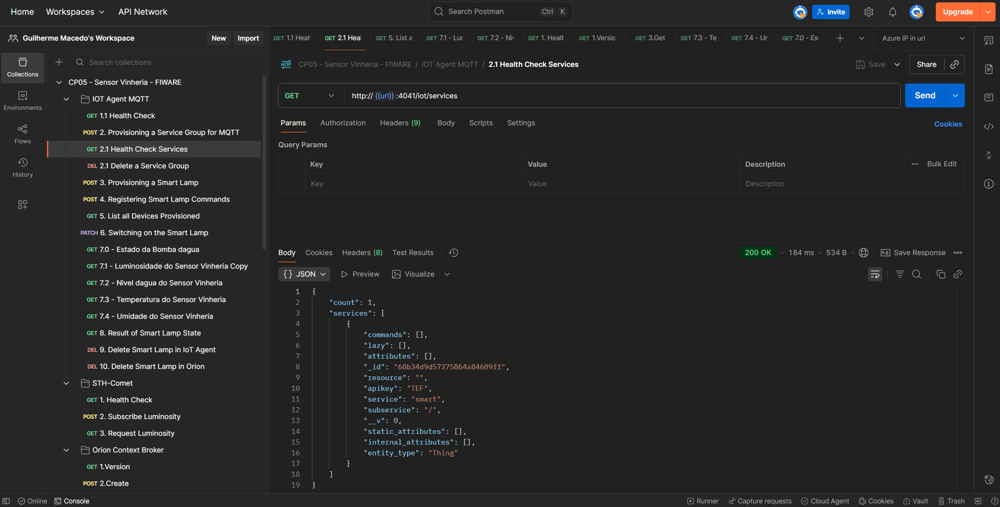

#### Lising all devices
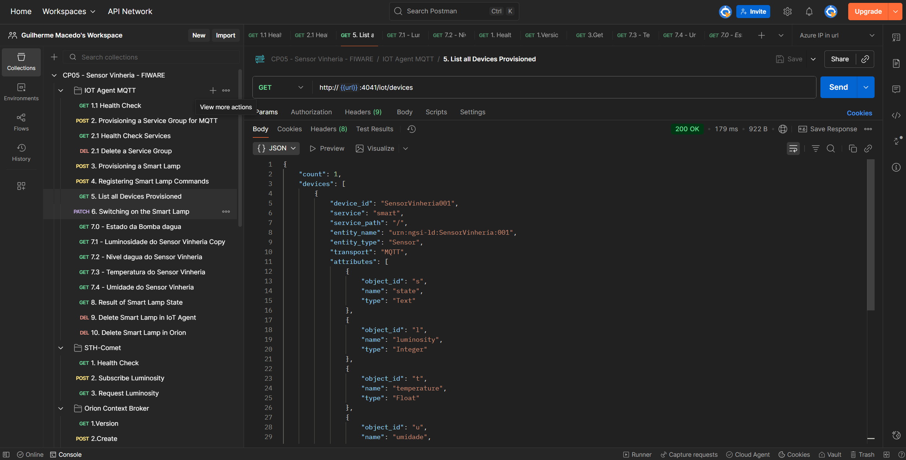
Screen Shot exibinding o dispositivo que foi nomeado SensorVinheria001 ao invez de Lamp001

#### Comet Health Check
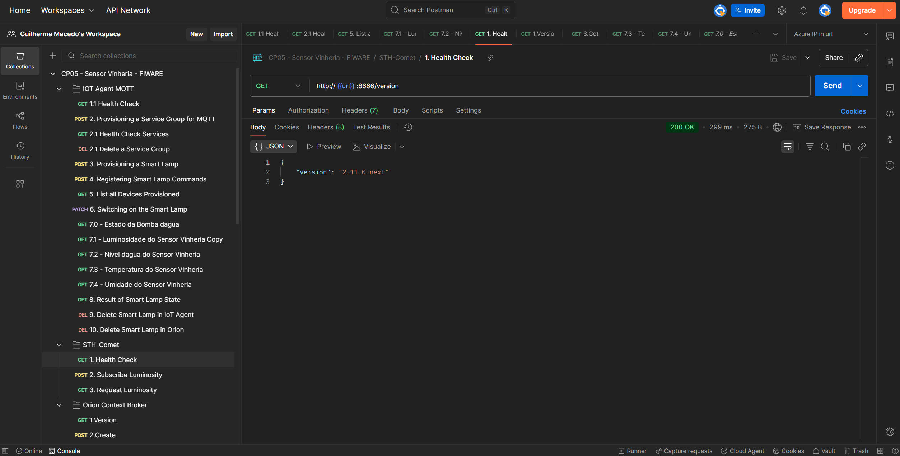

#### Orion Health Check
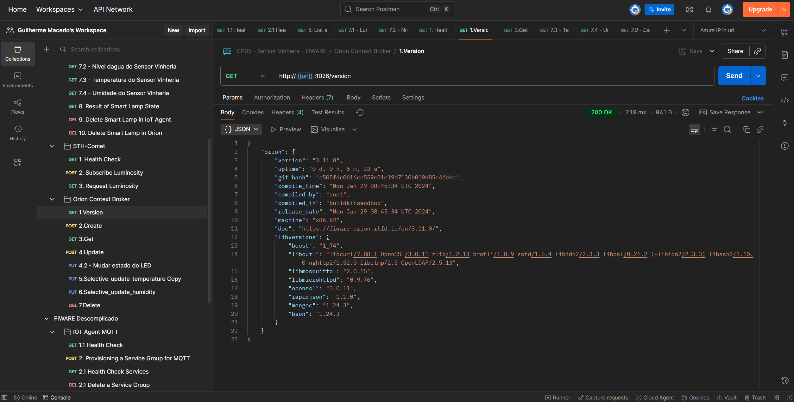

---

### Extra: Node-Red

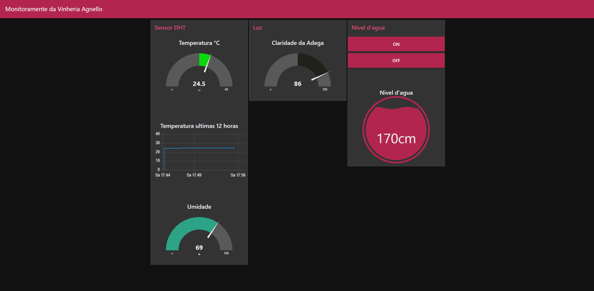

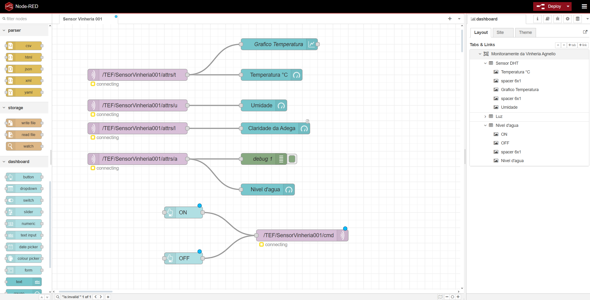