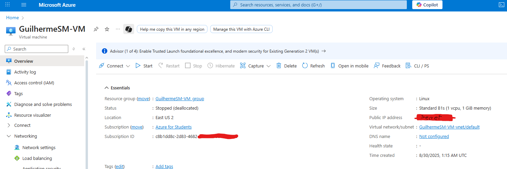

# ESPX-CP05-Edge-Computing
CP05 de Edge Computing - Monitoramente de uma Adega de uma Vinheria Teorica. Monitorando Temperatura, Luminosidade, Umidade e Nivel d'agua em casa de Inundação.

--- 

## Integrantes:

- Guilherme Satler Macedo     - RM 563330

- Laura Sousa Barreto         - RM 561965

- Matheus Freitas Vieira      - RM 566198

- Natalia Camargo de Souza    - RM 565769

---

#### Professor: Paulo Marcotti

### Docker FIWARE do professor Fábio Cabrini utilizado:
https://github.com/fabiocabrini/fiware

---

# Projeto Hands-On

Video demonstrando o funcionamento do ESP32 enviando dados de diversos sensores para o servidor Azure, com o FIWARE em funcionamento para a execução de uma IOT Cloud.

E com a confirmação do funcionamento do servidor e FIWARE coma utilização do PostMan.

https://youtu.be/6yw99pNxt34?si=EcjmgeKY3tj_qCBy

### Screenshot da página do VM no Azure

